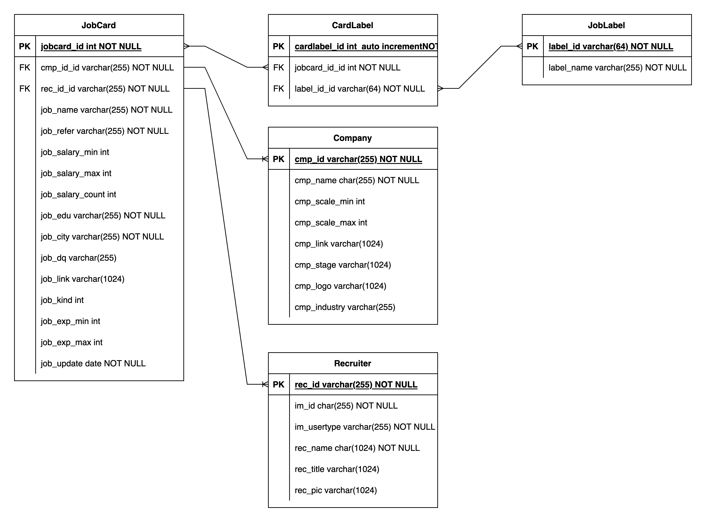

### 猎聘招聘信息爬虫

#### 说明

这是一个机遇猎聘Web版开发的爬虫，主要抓取的内容如下：

* 岗位摘要信息
* 岗位相关标签
* 企业基本信息
* HR/猎头信息

鉴于遵守猎聘的robots.txt，以及不对目标网站造成过大的网络资源浪费，所以不对岗位要求等详细信息进行爬取，如果您有兴趣可以自行改造或者遵循普通的访问流程进行访问。

猎聘对爬取内容进行了初步的限制，即爬取的翻页次数上限为10页，超过10页无法进行翻页，如果您找到了更好的办法也可以更换这个借口进行爬取。

爬虫项目主要通过Scrapy爬虫框架得以实现。

#### 数据库依赖

项目数据落地通过Redis+Mysql实现，两者定位不同

* Redis：缓存，主要用于除重验证或者其他快速查询
* Mysql：结构化数据存储（lp_job)

Mysql数据库执行文件：[lpjob_db.sql](https://github.com/hadesxiong/liepinjob-spider/blob/main/lpjob_db.sql "执行文件")

Mysql数据库结构如下：



> 请注意，在Scrapy项目结构下的settings中需要配置数据库的相关参数。

#### 处理逻辑

数据爬取 --> Redis缓存写入 -->  Mysql写入 --> 是否导出表判断。

#### 爬虫入参

爬虫支持3个参数入参：

* key_word: 岗位搜索关键字，例如：用户运营，这个参数是一定要入参的，否则可能会引起错误。
* city: 城市代码，例如：上海为020等，由于精力有限并未穷举所有城市代码，如果你想找到你的目标城市的代码，可以自行抓包进行分析，热门城市的城市代码已经在settings.py中进行补充。city这个字段的参数不是必入参的，默认为040（全国）。
* file_mark: 文件存储标志，默认为False，如果调整为True，则会调用pandas框架对jobcard/cmp/rec等三个数据进行拼接，形成宽表进行保存。

#### 代理中间件

设置了如果出现Tcperror或者Timeerror等错误抛出，爬虫会自动检测代理库来调整Request的代理。中间件源码中的代理可以写成固定的，也可以通过自建代理池进行动态更新。

代理池的建立基于此项目

[IPProxyPool](https://github.com/anjia0532/IPProxyPool)

如果不出现大量爬取的话，正常请求不会触发猎聘的反爬机制审核。

管道默认是关闭的，如果需要开启，请到settings.py中downloader middleware配置开启。

#### 多任务

如果需要进行多岗位/多城市迭代结果进行爬取，可直接运行run.py来实现。该脚本主要基于twisted进行实现，相关文件配置文件请在settings.py中对keyword和city进行配置，keyword和city均为数组形式。

如果你只希望运行单个爬虫，您可以直接在项目目录下执行如下文件

```shell
scrapy crawl lp_jobcard -a key_word=用户运营 -a city=020 -a file_mark=True
```

如果你希望运行多个爬虫，可以输入如下命令

```shell
python run.py
```

该命令会通过迭代器，讲settings.py中的key_word和city进行组合，生成爬虫命令，进行爬取。

#### 结果查询举例

上海/用户运营岗位/起薪分布

```sql
SELECT (
	CASE WHEN JOB_SALARY_MIN > 0 AND JOB_SALARY_MIN <= 20 THEN ("0-20")
	WHEN JOB_SALARY_MIN > 20 AND JOB_SALARY_MIN <= 40 THEN ("20-40")
	WHEN JOB_SALARY_MIN > 40 AND JOB_SALARY_MIN <= 60 THEN ("40-60")
	WHEN JOB_SALARY_MIN > 60 AND JOB_SALARY_MIN <= 80 THEN ("60-80")
	ELSE ("80+")
	END
) AS SALARY_RANGE, COUNT(JOBCARD_ID) AS JOB_NUM FROM JOBCARD WHERE JOB_CITY = "上海"
GROUP BY (
	CASE WHEN JOB_SALARY_MIN > 0 AND JOB_SALARY_MIN <= 20 THEN ("0-20")
	WHEN JOB_SALARY_MIN > 20 AND JOB_SALARY_MIN <= 40 THEN ("20-40")
	WHEN JOB_SALARY_MIN > 40 AND JOB_SALARY_MIN <= 60 THEN ("40-60")
	WHEN JOB_SALARY_MIN > 60 AND JOB_SALARY_MIN <= 80 THEN ("60-80")
	ELSE ("80+")
	END
)
```

行业-岗位分布

```sql
SELECT COMPANY.CMP_INDUSTRY,COUNT(JOBCARD.JOBCARD_ID)
FROM COMPANY,JOBCARD 
WHERE COMPANY.CMP_ID = JOBCARD.CMP_ID_ID
GROUP BY COMPANY.CMP_INDUSTRY
```

岗位标签频次分布

```sql
SELECT JOBLABEL.LABEL_NAME,B.COUNT_NUM FROM 
(SELECT CARDLABEL.LABEL_ID_ID AS ID,COUNT(DISTINCT CARDLABEL.JOBCARD_ID_ID) AS COUNT_NUM FROM CARDLABEL GROUP BY CARDLABEL.LABEL_ID_ID) AS B,JOBLABEL
WHERE JOBLABEL.LABEL_ID = B.ID
```

也可以根据你的实际需求进行拓展。
